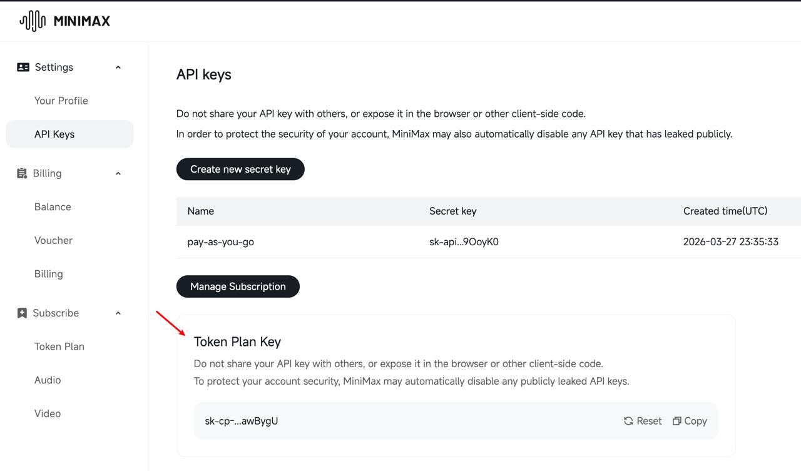

# Prompt Scheduler — 每日 Prompt 生成與 Senior Review 排程

## 必要設定

### 1. 取得 MiniMax API Key（Token Plan）

1. 前往 [platform.minimax.io/user-center/basic-information/interface-key](https://platform.minimax.io/user-center/basic-information/interface-key)
2. 切換到 **Token Plan Key** 分頁（如圖所示）
3. 建立並複製 API Key

> 📍 **截圖指引**：
> 

### 2. 設定環境變數

```bash
export MINIMAX_API_KEY="你的Token Plan API Key"
```

---

## 概述

每日從 30 個主題庫中隨機抽取，生成 50 個多樣化 prompt，並經過 **Senior Prompt Engineer Review** 機制審查後存入正式庫。

---

## 流程架構

```
┌─────────────────────────────────────────────────────┐
│  每日觸發 (HEARTBEAT.md cron / 手动呼叫)              │
└─────────────────┬───────────────────────────────────┘
                  ▼
┌─────────────────────────────────────────────────────┐
│  1. 從 themes.json 讀取 30 個主題                    │
│  2. 隨機分配權重（熱門主題出現頻率較高）               │
│  3. 生成 50 個 raw prompts                          │
└─────────────────┬───────────────────────────────────┘
                  ▼
┌─────────────────────────────────────────────────────┐
│  2. Senior Prompt Engineer Review                   │
│     - Clarity / Specificity / Technical / Safety   │
│     - Creativity / Prompt Fluency                  │
│     - 評分 0-10，門檻 ≥ 7 分，通過者進 approved.json │
│     - 未通過者進 rejected.json（含原因）              │
└─────────────────┬───────────────────────────────────┘
                  ▼
┌─────────────────────────────────────────────────────┐
│  3. 結果寫入 references/prompts/approved.json        │
│  4. 同步更新 HEARTBEAT_OK                            │
└─────────────────────────────────────────────────────┘
```

---

## Senior Prompt Engineer Review 評分標準

每個 prompt 由以下六個維度評分（各 0-10），取平均為最終分數：

| 維度 | 說明 | 權重 |
|------|------|------|
| **Clarity** | Prompt 描述是否清晰明確，無歧義 | 20% |
| **Specificity** | 主體/場景/物件細節是否具體 | 20% |
| **Technical** | 光線/構圖/風格/角度描述完整性 | 20% |
| **Safety** | 是否含有敏感詞彙或爭議內容（此項採否決制） | 15% |
| **Creativity** | 主題/組合是否新穎有創意 | 15% |
| **Fluency** | Prompt 英文語法和流暢度 | 10% |

**通過條件**：平均分 ≥ 7.0，且 Safety ≠ 0

---

## 觸發方式

### 手動觸發（測試用）
```bash
cd ~/.openclaw/workspace/skills/minimax-image-gen/scripts
node scheduler.js --date 2026-03-30
```

### 每日自動排程
透過 OpenClaw HEARTBEAT.md 設定。將以下內容寫入 HEARTBEAT.md（或維持空白並由 Agent 觸發）：

```markdown
## 每日 Prompt 生圖排程
- 檢查今日是否已執行 scheduler
- 若否，執行 `node scheduler.js`
```

---

## 輸出檔案

| 檔案 | 內容 |
|------|------|
| `prompts/daily/YYYY-MM-DD.json` | 當日生成+審查後的全部 prompt（含分數） |
| `prompts/approved.json` | 累積通過審查的 prompt（遞增） |
| `prompts/rejected.json` | 累積未通過的 prompt（含維度分數和原因） |
| `prompts/stats.json` | 每日統計（生成數、通過率、平均分） |

---

## 每日生成配置

```javascript
{
  "daily_prompt_count": 50,
  "themes_weighted": true,      // 主題出現頻率加權
  "review_threshold": 7.0,       // 通過分數門檻
  "safety_veto": true,           // Safety=0 即拒絕
  "output_daily": true,          // 每日獨立檔案
  "output_append_approved": true // 同步寫入 approved.json
}
```

---

## 與 MiniMax API 的銜接

通過審查的 prompt 可直接用於生圖：

```javascript
const { approved } = require('../references/prompts/approved.json');
const { generateImage } = require('../api');

for (const prompt of approved.slice(-10)) {
  const result = await generateImage({
    prompt: prompt.content,
    aspectRatio: prompt.aspect_ratio || '1:1',
    n: 1,
  });
  console.log(result.images[0]);
}
```
